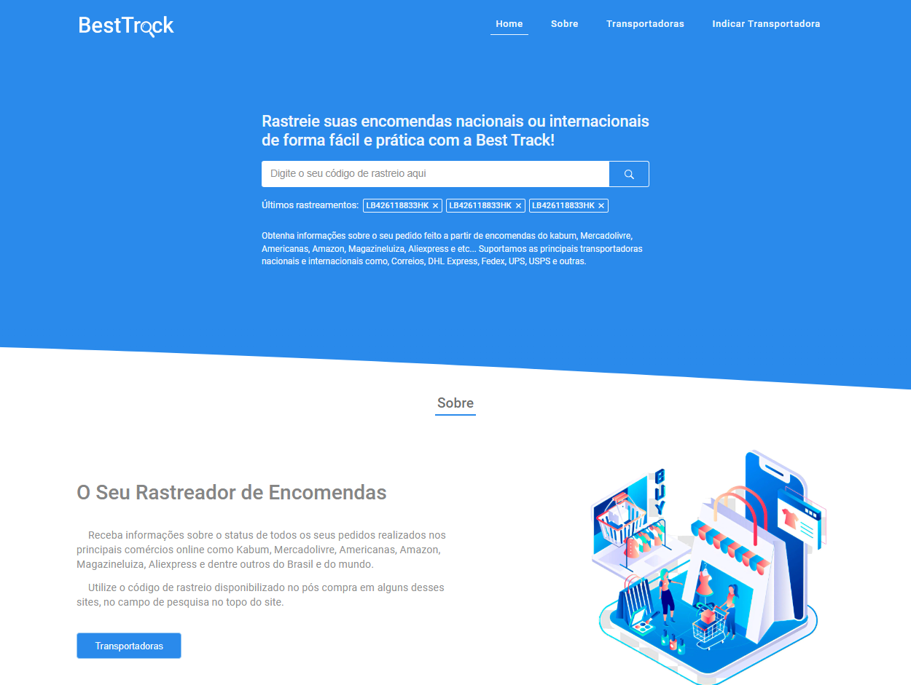
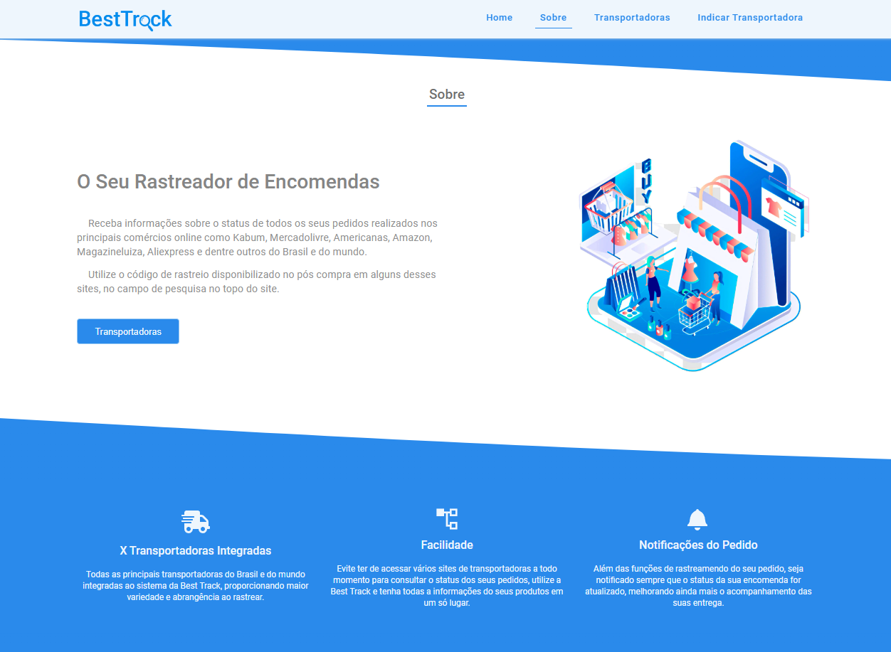
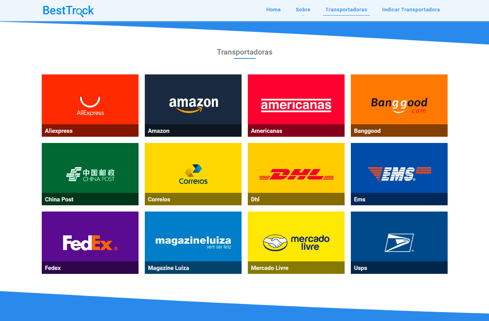
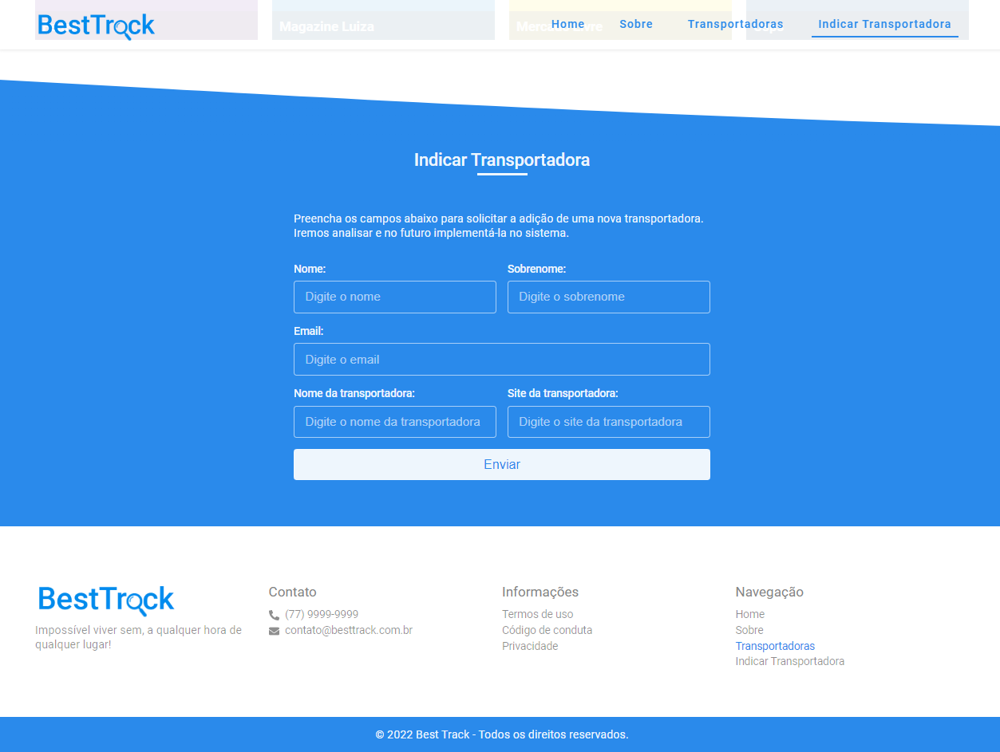

# Resumo:
O projeto consiste na construção de um sistema de rastreamento de encomendas nacionais e internacionais. O objetivo é por em prática os conhecimentos adquiridos em estudo com react e nextjs.

# Interface do Sistema:
Abaixo estão algumas screenshots da plataforma.

| Página Inicial - Início |
| :- |
| *Landing page da plataforma.* |
 

 
 

| Página Inicial - Sobre |
| :- |
| *Landing page da plataforma.* |
 

 
 

| Página Inicial - Transportadoras |
| :- |
| *Landing page da plataforma.* |
 

 
 

| Página Inicial - Indicar Transportadora |
| :- |
| *Landing page da plataforma.* |
 

 
 
